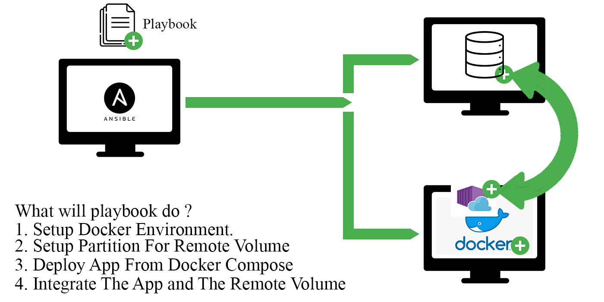

# Project Portofolio #1 : Deploying Container APP (From Docker Compose) With Remote Volume Using Automation Ansible
**Gambaran Project Portofolio #1**

## Informasi Environment/Tools
* Virtual Machine Pertama  - RedHat 8  (Ansible - Control Node)
* Virtual Machine Kedua - Ubuntu 18 (Ansible - Managed Node Pertama)  [Untuk Docker Instance]
* Virtual Machine Ketiga - Ubuntu 18 (Ansible - Managed Node Kedua) [Untuk Remote Volume Instance]

Early Note :
Pada project portofolio #1, ini diharapkan ketiga virtual machine sudah menjadi sebuah cluster ansible, dimana control node nya sudah dapat menjalankan sebuah playbook ke semua managed node. Dan ketiga virtual machine memiliki akses internet.

## Beberapa File/Direktori Yang Perlu Diperhatikan
* simple_website : Merupakan direktori aplikasi (Aplikasi Website dan Database) yang akan diimplementasikan, namun dapat diabaikan saja karena file-file tersebut sudah disediakan sendiri didalam direktori 'Dockerizing Simple Website'.
* Dockerizing Simple Website : Merupakan direktori yang berisikan segala hal keperluan docker host (file docker-compose.yml, dan dockerfile).
* inventory : Berisikan informasi managed host dan alamat ip yang digunakan.
* playbook-pp1.yml : Merupakan Playbook yang digunakan untuk mendeploy/mengimplementasikan project ini.
* .env : Merupakan file environment variable, jadi file ini berisikan segala variable yang akan digunakan. file ini akan digunakan oleh docker-compose.yml

## Beberapa Hal Yang Perlu Diatur/Dipastikan Secara Manual 
### Di Control Node :
- File Inventory
  - Terdapat 2 buah baris penting yang menginformasikan IP Docker Instance dan Remote Volume Instance, Sesuaikan!.
- File Playbook : 
  - Tiap Play pada Playbook, menggunakan akun "remote_user" yang tersedia di instance yang bersangkutan, Sesuaikan!.
  - Perhatikan bahwa beberapa play menggunakan environment variable ("home_dir") yang merujuk ke home direktori user bersangkutan, Sesuaikan!.
  - Terdapat environment variable ("pvs") yang merujuk ke unused storage, Sesuaikan!.
### Di Docker Node :
- env :
  - Perhatikan variable rmvolume_ip dan rmvolume_user, sesuaikan value variable tersebut dengan informasi instance remote volume.
### Di Control Node - Docker Node - Remote Volume Node
- Ketahuilah Project ini akan mengimplementasikan partisi untuk keperluan remote volume. Baik pada file playbook ansible, file .env docker, dan unused storage (free partisi) di linux semuanya harus saling berhubungan. Jadi pastikan masing saling berkaitan. Jangan sampai, pada playbook merujuk ke free partisi /dev/sdb tetapi pada kenyataannya di remote instance free partisinya terdapat pada /dev/sdc. atau case lain, playbook memounting partisi ke /remote_volume tetapi environment variable (file .env docker) malah ter-set bukan ke /remote_volume

## Cara Mengimplementasikan Project Ini
1. Pastikan catatan catatan diatas sudah sesuai.
2. Download Source Code, Dengan melakukan git clone terhadap repo ini.
3. Jalankan Playbook.
